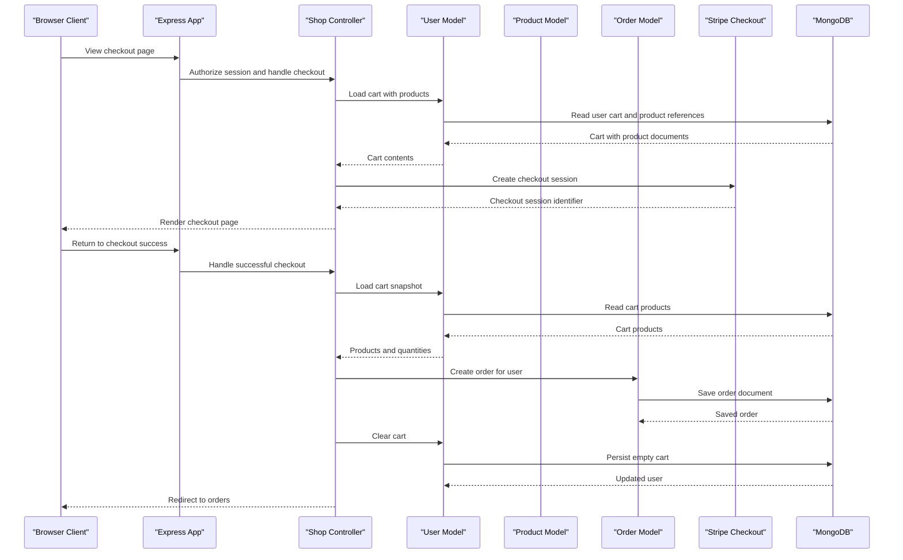

# API & Service Communication Contracts

The application exposes a server-rendered Express web surface with 23 route handlers across shop, admin, and authentication areas. Communication is primarily synchronous HTTP form/page handling with outbound calls to payment and email services.

## Service Catalog

| Service | Port | Category | Purpose |
|---|---:|---|---|
| Node.js shopping web app | `PORT` environment variable or 3000 | API Layer and Business | Serves storefront pages, product administration pages, authentication flows, cart checkout, order history, and invoice downloads |
| MongoDB Atlas | Not defined in repository | Infrastructure | Stores application documents and session records |
| Stripe Checkout | External HTTPS | Infrastructure | Creates hosted payment checkout sessions |
| Sendinblue SMTP | 587 | Infrastructure | Sends signup and password reset emails |

## API Endpoints Inventory

| Service | Method | Path | Request Type | Response Type |
|---|---|---|---|---|
| Node.js shopping web app | GET | `/` | Query parameters for pagination | EJS storefront index page |
| Node.js shopping web app | GET | `/products` | Query parameters for pagination | EJS product list page |
| Node.js shopping web app | GET | `/products/:productId` | Path parameter `productId` | EJS product detail page |
| Node.js shopping web app | GET | `/cart` | Authenticated session | EJS cart page |
| Node.js shopping web app | POST | `/cart` | Form body with product identifier and CSRF token | Redirect to cart |
| Node.js shopping web app | POST | `/cart/delete-item` | Form body with product identifier and CSRF token | Redirect to cart |
| Node.js shopping web app | GET | `/checkout` | Authenticated session with cart contents | EJS checkout page with Stripe session identifier |
| Node.js shopping web app | GET | `/checkout/success` | Authenticated session after payment redirect | Redirect to orders after order creation |
| Node.js shopping web app | GET | `/checkout/cancel` | Authenticated session | EJS checkout page |
| Node.js shopping web app | GET | `/orders` | Authenticated session | EJS order history page |
| Node.js shopping web app | GET | `/orders/:orderId` | Path parameter `orderId` and authenticated session | PDF invoice stream |
| Node.js shopping web app | GET | `/admin/add-product` | Authenticated session | EJS product form page |
| Node.js shopping web app | POST | `/admin/add-product` | Multipart form data with product fields, image file, and CSRF token | Redirect or validation error page |
| Node.js shopping web app | GET | `/admin/products` | Authenticated session and pagination query | EJS admin products page |
| Node.js shopping web app | GET | `/admin/edit-product/:productId` | Path parameter `productId`, query `edit`, authenticated session | EJS edit product page or redirect |
| Node.js shopping web app | POST | `/admin/edit-product` | Multipart form data with product fields, optional image, and CSRF token | Redirect or validation error page |
| Node.js shopping web app | POST | `/admin/delete-product` | Form body with product identifier and CSRF token | Redirect to admin products |
| Node.js shopping web app | GET | `/login` | Browser request | EJS login page |
| Node.js shopping web app | POST | `/login` | Form body with email, password, and CSRF token | Redirect or validation error page |
| Node.js shopping web app | GET | `/signup` | Browser request | EJS signup page |
| Node.js shopping web app | POST | `/signup` | Form body with email, password, confirm password, and CSRF token | Redirect or validation error page |
| Node.js shopping web app | POST | `/logout` | Authenticated or anonymous session and CSRF token | Redirect to home |
| Node.js shopping web app | GET | `/reset` | Browser request | EJS password reset request page |
| Node.js shopping web app | POST | `/reset` | Form body with email and CSRF token | Redirect and reset email when account exists |
| Node.js shopping web app | GET | `/reset/:token` | Path parameter `token` | EJS new password page |
| Node.js shopping web app | POST | `/new-password` | Form body with user id, password token, new password, and CSRF token | Redirect to login |

## Management & Observability Endpoints

| Service | Endpoint | Custom Metrics (if any) |
|---|---|---|
| Node.js shopping web app | None detected | Morgan writes combined access logs to `access.log`; no metrics endpoint or health endpoint was detected |

## DTOs & Contracts

The application does not define separate DTO classes or OpenAPI, GraphQL, or protobuf contracts. Browser form submissions and route parameters act as request contracts, EJS templates act as HTML response contracts, and Mongoose models are passed directly into rendering contexts. Serialization uses Express form parsing for URL encoded forms, Multer for multipart image uploads, Mongoose document serialization for persistence, PDFKit for invoice streams, and Stripe SDK request objects for checkout session creation.

## Communication Patterns

Requests are handled synchronously through Express middleware and controllers. Internal communication uses direct CommonJS module calls from routes to controllers and from controllers to Mongoose models. Outbound communication is synchronous from the checkout flow to Stripe and from authentication flows to SMTP. No asynchronous messaging, message brokers, service discovery, client-side load balancing, retry policy, timeout policy, circuit breaker, or API gateway was detected. Session authentication and CSRF tokens protect mutating routes, Helmet adds HTTP security headers, and password hashes are stored with bcryptjs; TLS termination is not configured in application code and is expected to be provided by the hosting environment.

## Service Technology Matrix

| Service | Web | Data Access | Discovery | Gateway | Actuator | Cache | Metrics |
|---|---|---|---|---|---|---|---|
| Node.js shopping web app | Express MVC with EJS | Mongoose to MongoDB | None | None | None | MongoDB-backed session store | Morgan access logs only |

## Service Communication Sequence

