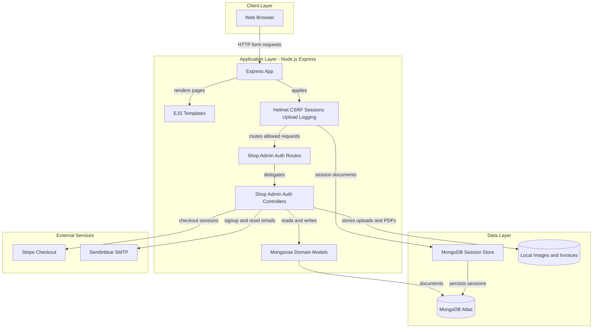
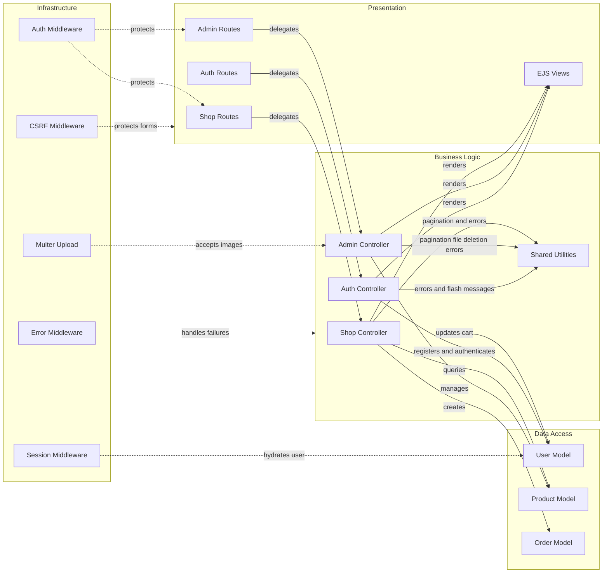

# Architecture Diagram

This document summarizes the Node.js shopping application's runtime architecture and the major component relationships observed in the repository.

## Application Architecture

### Technology Stack Summary

| Layer | Technology | Version | Purpose |
|---|---:|---:|---|
| Runtime | Node.js | 14 documented in README; current execution used Node 22 | JavaScript server runtime |
| Web | Express | 4.17.1 | HTTP routing and middleware pipeline |
| Presentation | EJS | 3.1.3 | Server-side HTML view rendering |
| Security Middleware | Helmet, csurf, express-session, bcryptjs | 3.23.0, 1.11.0, 1.17.1, 2.4.3 | HTTP headers, CSRF protection, session auth, password hashing |
| Data Access | Mongoose, MongoDB driver | 5.9.17, 3.5.8 | ODM and MongoDB connectivity |
| File Handling | Multer, PDFKit | 1.4.2, 0.11.0 | Product image uploads and invoice PDF generation |
| External Services | Stripe, Nodemailer, Sendgrid transport | 8.60.0, 6.4.8, 0.2.0 | Payment checkout and transactional email |
| Operations | Morgan, compression | 1.10.0, 1.7.4 | Access logging and HTTP response compression |

### Data Storage & External Services

The application stores users, products, orders, carts, password reset tokens, and Express session records in MongoDB Atlas through Mongoose and `connect-mongodb-session`. Uploaded product images and generated invoices are written to local filesystem paths, while Stripe provides payment checkout sessions and Sendinblue SMTP sends signup and password reset emails.

### Key Architectural Decisions

- Uses a single server-rendered Express monolith with route modules for shop, admin, and authentication features.
- Stores shopping cart state inside the user document and snapshots purchased products into order documents at checkout success time.
- Uses middleware for cross-cutting concerns including session restoration, CSRF tokens, security headers, compression, access logging, and file upload handling.

## Component Relationships

### Component Inventory

| Component | Layer | Type | Responsibility |
|---|---|---|---|
| `app.js` | Infrastructure | Express bootstrap | Configures middleware, route mounting, MongoDB connection, and server startup |
| `routes/shop.js` | Presentation | Express router | Defines catalog, cart, checkout, orders, and invoice routes |
| `routes/admin.js` | Presentation | Express router | Defines product administration routes and product form validation middleware |
| `routes/auth.js` | Presentation | Express router | Defines login, signup, logout, and password reset routes and auth validation middleware |
| `controllers/shop.js` | Business Logic | Controller module | Handles catalog display, cart updates, Stripe checkout, order creation, and invoice rendering |
| `controllers/admin.js` | Business Logic | Controller module | Handles product creation, update, listing, deletion, and uploaded image lifecycle |
| `controllers/auth.js` | Business Logic | Controller module | Handles signup, login, session lifecycle, password reset tokens, and transactional emails |
| `models/user.js` | Data Access | Mongoose model | Persists user credentials, reset tokens, and embedded cart entries |
| `models/product.js` | Data Access | Mongoose model | Persists product catalog entries owned by users |
| `models/order.js` | Data Access | Mongoose model | Persists order snapshots linked to users |
| `middleware/is-auth.js` | Infrastructure | Express middleware | Redirects unauthenticated users away from protected pages |
| `utils.js` | Infrastructure | Utility module | Provides paginated product fetching, flash message retrieval, error forwarding, and file deletion |
