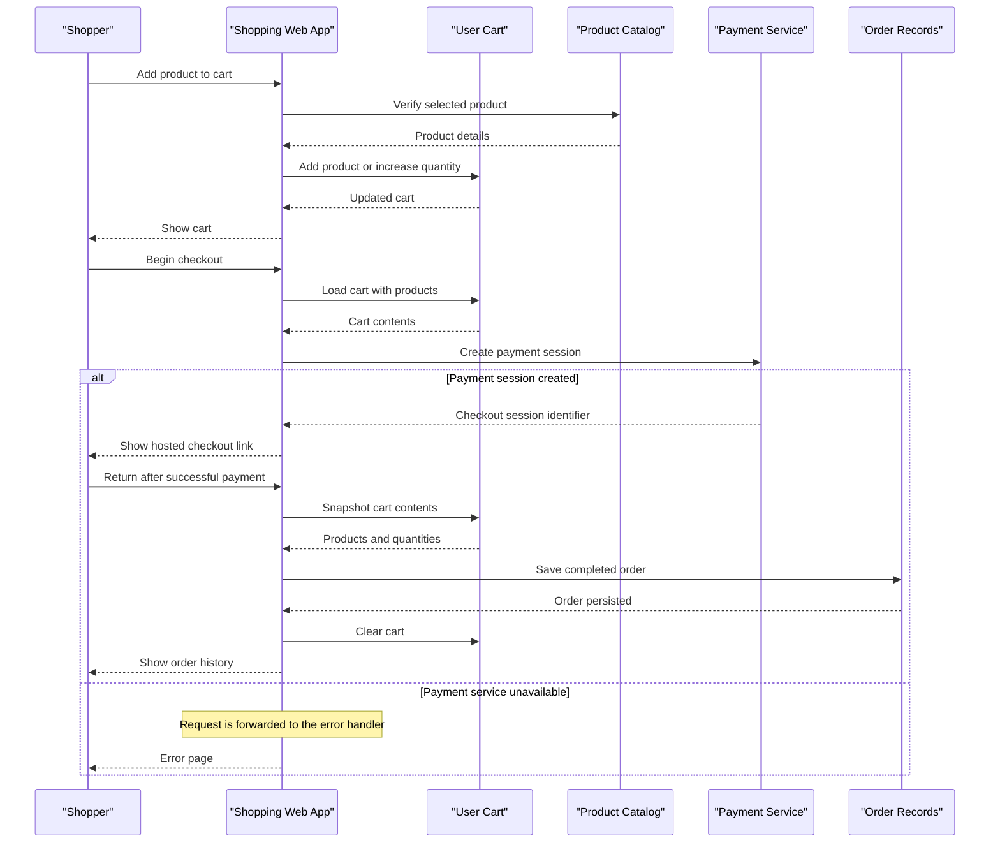

# Core Business Workflows

The application supports an online shopping domain where visitors browse products, authenticated users manage carts and orders, and product owners maintain catalog items.

## Domain Entities

| Entity | Service / Bounded Context | Description | Key Relationships |
|---|---|---|---|
| User | Account and Shopping | Customer or product owner account used for authentication, password reset, cart ownership, and order ownership | Owns a cart, can own products, and places orders |
| Product | Catalog Management | Sellable item with pricing, description, and image information | Owned by a user; can appear in carts and order snapshots |
| CartItem | Shopping Cart | User-selected product and quantity before checkout | Embedded in a user cart and references a product |
| Order | Order Management | Completed purchase record created after successful checkout return | Belongs to a user and contains purchased item snapshots |
| OrderItem | Order Management | Immutable purchase line item captured from the cart at order creation time | Embedded in an order with quantity and product snapshot |
| Session | Account and Shopping | Browser session state used to track login state and current user | Associated with a user through the active session payload |

## Service-to-Domain Mapping

| Service | Domain Context | Owned Entities | External Dependencies |
|---|---|---|---|
| Node.js shopping web app | Account, Catalog, Shopping Cart, Checkout, Order Management | User, Product, CartItem, Order, OrderItem, Session | MongoDB Atlas for persistence, Stripe for checkout, Sendinblue SMTP for email |

## Primary Workflows

### Workflow 1: Customer signs up and logs in

A visitor submits signup details through the authentication routes. The auth validation rules verify email shape, password format, password confirmation, and email uniqueness. When valid, the password is hashed, a user with an empty cart is saved, and a signup email is sent. During login, submitted credentials are validated, the user is looked up by email, the password hash is checked, and the authenticated session is persisted before redirecting to the storefront.

### Workflow 2: Product owner manages catalog items

An authenticated user opens the add or edit product form, submits product details and an image, and the admin validation rules verify product content. On creation, the product is saved with the authenticated user as owner. On edit or delete, ownership is checked before state changes are persisted; replaced or deleted product images are removed from local storage.

### Workflow 3: Shopper checks out cart and creates an order

An authenticated shopper adds products to the cart, where duplicate product selections increase the quantity rather than creating a separate cart entry. At checkout, the application loads populated cart items, creates a Stripe checkout session, and renders the checkout page. After the success redirect, the application snapshots cart products into a new order, saves it, clears the cart, and redirects the shopper to order history.

### Workflow 4: Customer retrieves invoice

An authenticated customer requests an invoice for an order. The application loads the order, verifies that the order belongs to the authenticated user, generates a PDF invoice stream with line items and total price, writes a copy under the invoice data directory, and streams the PDF response.

### Workflow 5: Customer resets password

A user requests password reset by email. If the account exists, the application generates a one-hour token, stores it on the user, and sends a reset link. When the token is presented, the user can submit a new password; the password is hashed, the reset token is cleared, and the user is redirected to login.

## Cross-Service Data Flows

No independently deployed internal services or cross-service data composition flows were detected. The primary external flow is checkout: cart data is loaded from MongoDB, transformed into Stripe checkout line items, and later converted into an order snapshot after the checkout success redirect. If Stripe or SMTP is unavailable, the related request fails through the general error path; no fallback, retry, or circuit breaker behavior was detected.

## Business Workflow Sequence

## Business Rules & Decision Logic

- Authentication routes validate email format, password length and alphanumeric content, matching confirmation password, and signup email uniqueness.
- Product administration validates title length, numeric price, description length, and image presence for new products.
- Product edit and delete operations enforce ownership by comparing the product owner to the authenticated user.
- Cart additions merge duplicate products by increasing quantity; cart deletion removes matching product entries.
- Checkout creates orders from a snapshot of the populated cart and clears the cart only after the order save succeeds.
- Invoice retrieval requires an existing order and authenticated user ownership before PDF generation.
- Password reset tokens expire after one hour and are cleared after password replacement.
- Request failures are routed to a generic error handler; no business compensation workflow or audit trail was detected.
