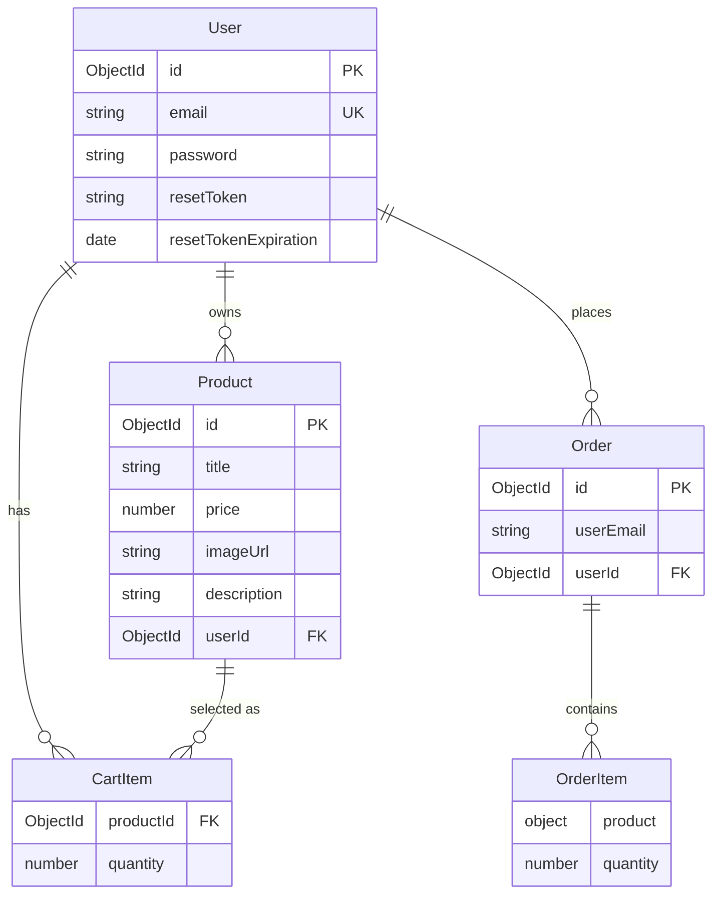

# Data Architecture & Persistence Layer

The data layer contains three Mongoose domain models backed by MongoDB Atlas, plus MongoDB-backed Express session records. No migration framework or separate repository classes were detected.

## Database Configuration

| Service/Module | DB Type | Profile | Driver | Connection | Migration Tool |
|---|---|---|---|---|---|
| Node.js shopping web app | MongoDB Atlas | Default runtime | MongoDB Node.js driver via Mongoose 5.9.17 | Built from environment-provided MongoDB user, password, and database name | None detected |
| Node.js shopping web app sessions | MongoDB Atlas | Default runtime | connect-mongodb-session 2.3.2 | Reuses the application MongoDB connection string and stores sessions in a `sessions` collection | None detected |
| Legacy or unused relational stack | MySQL | Not configured | mysql2 2.1.0 and Sequelize 5.21.11 declared | No active connection configuration found in current source | None detected |

## Data Ownership per Service

| Service | Tables Owned | ORM Framework | Caching | Notes |
|---|---|---|---|---|
| Node.js shopping web app | `users`, `products`, `orders`, `sessions` MongoDB collections | Mongoose ODM for domain documents; connect-mongodb-session for sessions | No application data cache detected; sessions are persisted in MongoDB | Single application owns all domain collections and embeds cart and order line-item snapshots |

## Entity Model

## Key Repository Methods

| Service | Repository | Notable Methods | Purpose |
|---|---|---|---|
| Node.js shopping web app | `models/Product` Mongoose model | `find`, `findById`, `countDocuments`, `deleteOne`, `save` | Product listing with pagination, product detail lookup, owner-filtered admin listing, create, update, and delete |
| Node.js shopping web app | `models/User` Mongoose model | `findById`, `findOne`, `save`, instance methods `addToCart`, `deleteProductFromCart`, `clearCart` | Session user hydration, login and reset lookup, cart mutation, and credential or token persistence |
| Node.js shopping web app | `models/Order` Mongoose model | `find`, `findById`, `save` | Persist checkout order snapshots, list user orders, and load invoices |

## Caching Strategy

No general-purpose application data cache, HTTP cache, or ODM second-level cache was detected. The application uses MongoDB as a persistent session store through `connect-mongodb-session`; this keeps login state outside process memory but is not used as a cache-aside layer for product, order, or user query results.

## Data Ownership Boundaries

All domain data is owned by a single deployable Express service and stored in one MongoDB database. There are no service-per-database boundaries or cross-service database reads. Controllers access Mongoose models directly, with product references embedded in user carts and product snapshots embedded in orders to preserve purchased item details. No CQRS split, event sourcing, outbox, or asynchronous data propagation pattern was detected.

### Data Classification & Sensitivity

| Entity | Sensitive Fields | Classification (PII/PHI/PCI/None) | Controls in Place |
|---|---|---|---|
| User | email, password, resetToken | PII and credentials | Passwords are hashed with bcryptjs; no field-level encryption or masking detected for email or reset token |
| Product | title, description, imageUrl, userId | Low sensitivity business data | Owner authorization checks exist for edits and deletes; no encryption or masking detected |
| CartItem | productId, quantity | Low sensitivity behavioral data | Protected by session authentication; no encryption or masking detected |
| Order | user.email, user.userId, product snapshots | PII and purchase history | Invoice access checks compare order owner to authenticated user; no field-level encryption or masking detected |
| Session | session identifier and serialized session data | Session security data | Stored in MongoDB-backed session collection; session secret is configured in application code rather than a secret store |
