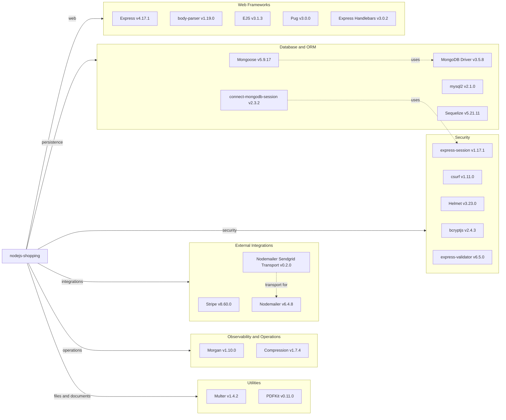

# Dependency Map

The `nodejs-shopping` application declares 17 runtime dependencies and 1 development dependency in `package.json`, with additional transitive packages captured by `package-lock.json`.

## Dependencies

### Dependency Summary

| Category | Count | Key Libraries | Notes |
|---|---:|---|---|
| Web Frameworks | 5 | Express 4.17.1, body-parser 1.19.0, EJS 3.1.3 | Server-rendered web application; Pug and Handlebars are declared but no matching templates were observed |
| Database and ORM | 5 | Mongoose 5.9.17, MongoDB 3.5.8, connect-mongodb-session 2.3.2 | MongoDB is the active data store; Sequelize and mysql2 appear unused in current source |
| Security | 5 | bcryptjs 2.4.3, csurf 1.11.0, Helmet 3.23.0, express-session 1.17.1 | Session and CSRF-based protection with password hashing |
| External Integrations | 3 | Stripe 8.60.0, Nodemailer 6.4.8, nodemailer-sendgrid-transport 0.2.0 | Payment and transactional email integrations |
| Observability and Operations | 2 | Morgan 1.10.0, compression 1.7.4 | Access logging and response compression |
| Utilities | 2 | Multer 1.4.2, PDFKit 0.11.0 | File upload handling and PDF invoice generation |

### Version & Compatibility Risks

The dependency assessment identified available major updates for Express, Mongoose, MongoDB, Stripe, Helmet, Multer, bcryptjs, EJS, and other runtime packages. Node.js 14 is documented in the README and is end-of-life, while Mongoose 5, Sequelize 5, and older middleware packages may require compatibility testing before modernization.

### Notable Observations

- `package.json` declares both MongoDB/Mongoose and MySQL/Sequelize stacks, but the current application code only uses MongoDB through Mongoose.
- Three template engines are declared, while the application configures and uses EJS views.
- Security-sensitive packages are present for session auth, password hashing, CSRF, and HTTP headers, but several are multiple major versions behind current releases.
- No package manager workspaces or central dependency management files were found.

## Test Dependencies

| Framework | Version | Notes |
|---|---:|---|
| None detected | N/A | `package.json` does not declare a test script or test framework dependency |

Total test-scope dependencies: 0
No test dependencies detected. The only development dependency is `nodemon` 2.0.4 for local debugging, not automated tests.
